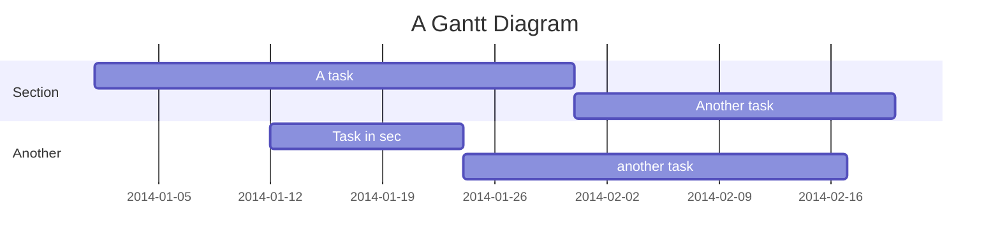

> [!NOTE]
> This is a NOTE
# 前言

## 1 使用git press服务搭建博客的不好的地方有：

### 1.1 参考来源
> [1. author's article](https://gitpress.io/@gitpress/)
> [2. 官方参看](https://gitpress.io/c/helps/welcome)

### 1.2 使用图片不方便，需要放在source同一个file route下面 
> [说法来源](https://gitpress.io/c/helps/troubleshooting)
>> example： 
>> 改成将.jpg 图片放置到和 xxx.md 文档的同级route下就会显示，

### 1.3 使用公式好像需要安装，虽然官方写的online coding 很新颖，但是安装使用起来还是需要本地的编译，还是不方便。
> [添加latex公式](https://gitpress.io/@gitpress/latex)
>> example:

>> 而不是会出现像 [这样的效果](https://mermaidjs.github.io/gantt.html)
>> 解决方法暂时还没有找到

2. 可以更新，但是延迟很严重，起码是一分钟的时间，
3. 要求的本地环境配置（要求有node.js/git/还需要的下载主题，要是的我换台电脑的好像就不能动我的网页了）

<!--more-->

## 使用git press服务搭建博客的好处有：

* 更新起来方便完全可以实现在github服务器端更新，部署起来不像hexo那么拖泥带水，需要配置一系列的环境变量
1. 全是静态文件，访问速度快；
2. 免费方便，不用花一分钱就可以搭建一个自由的个人博客，不需要服务器不需要后台；
3. 可以随意绑定自己的域名，不仔细看的话根本看不出来你的网站是基于github的；
4. 数据绝对安全，基于github的版本管理，想恢复到哪个历史版本都行；
5. 博客内容可以轻松打包、转移、发布到其它平台；
